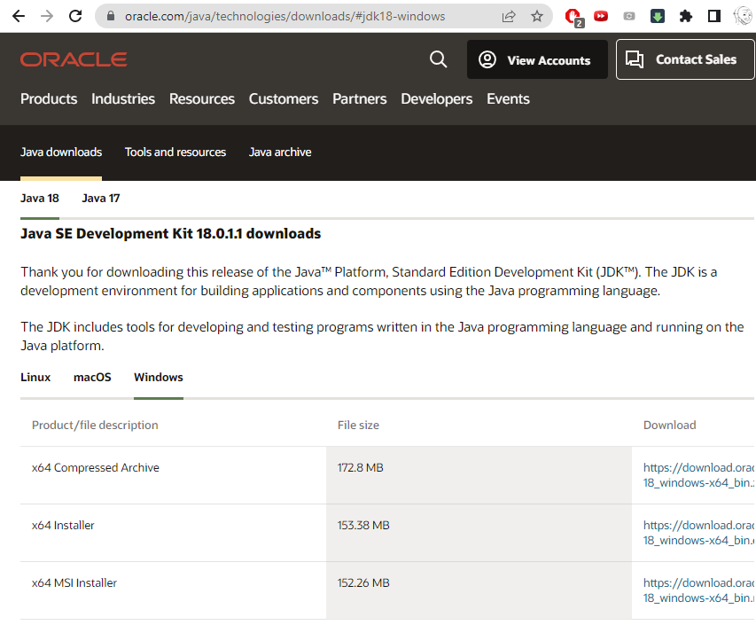
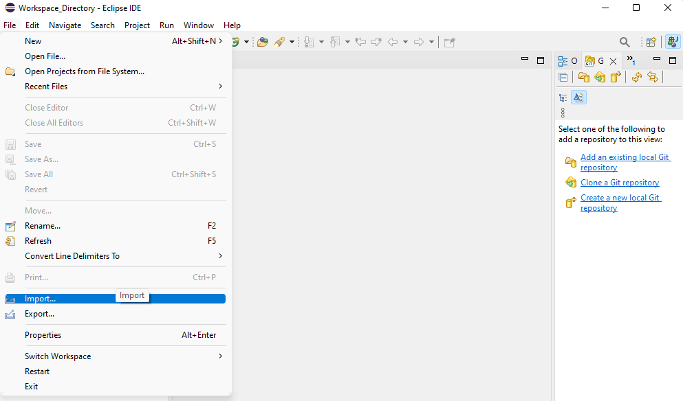
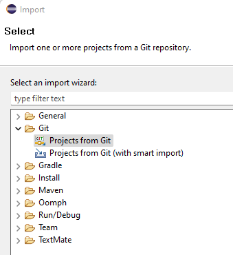
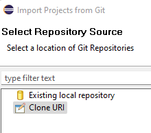
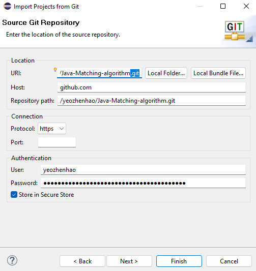
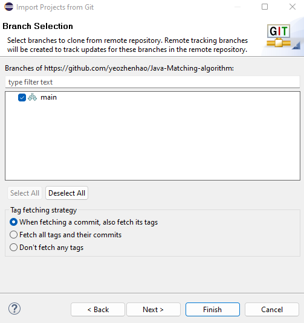
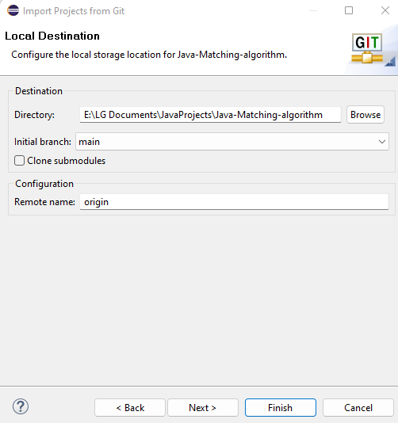
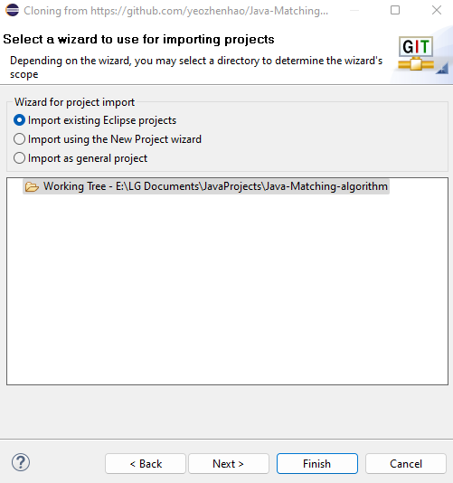
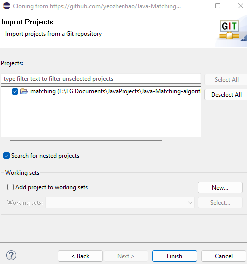
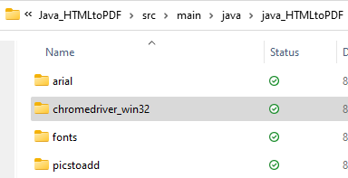

# Java_HTMLtoPDF
## A Java, HTML & CSS Web Scraping project with Selenium ChromeDriver: Creating a PDF version of the latest Mastering Psychiatry ebook on NUSMedicine website
# What this project is about
##### <ins>An essential textbook made better as a PDF</ins>
Mastering Psychiatry is an essential textbook for the Psychiatry posting in Year 4, authored by Melvyn WB Zhang (MBBS SG) and Cyrus SH Ho (MBBS SG). When I saw the 7th Edition (7ed) on NUSMedicine's website is much more aesthetically designed than the 6th Edition, I was elated to download it for my own offline use. Unfortunately, there was only the 6ed PDF available, which is both outdated and is in greyscale.

There were also problems with the website like the inability to zoom in, which makes it hard to read it on a phone.

As the 7ed ebook was likely designed in HTML and CSS (like a website), I felt that getting the PDF file of the 7ed Mastering Psychiatry ebook in the exact same colours and design would be almost impossible.

Thus, I spent 7 days to create my own Java script to convert the website's HTML code to PDF file. Although I was not able to access the CSS file on the website, I learnt that I could create my own CSS file so my script could use it to export the HTML code into a PDF that has the exact same styling as on the website. Thus, I managed to generate my PDF version of the 7ed Mastering Psychiatry on NUS Medicine's website. 

##### <ins>Improvements made in PDF compared to ebook</ins>
The following improvements were made to the 7ed PDF as compared to that on the NUS Medicine's website:
- PDF version of 7ed with all colours and design elements matched exactly with the website
- A4-sized PDF with 1cm margins for more content per page
- All images were manually added into the PDF by me as these were not transferred over with my script
- Font changed to Helvetica for easy reading
- PDF bookmarks added to match the bookmarked topics on the NUS Medicine's website

With permission from the authors, I shared the PDF with my batchmates. It helped me and my batchmates study Psychiatry better.

##### <ins>Java modules used:</ins>
- Selenium with ChromeDriver to load up HTML5 elements (which cannot be loaded with Jsoup alone)
- Jsoup to retrieve HTML code
- iText5 (aka Flying Saucer) to convert HTML to PDF with my custom CSS file

# How this project works

##### <ins>Installing Selenium</ins>
**1.** Install *Eclipse* and *Java Development Kit (JDK)*
| 
|:---:| 
| *Install the latest JDK* |

**2.** Click *File* -> *Import*
| 
|:---:| 
| *This Imports + Clones from the Github repository simultaneously* |

**3.** Click Projects from Git
| 
|:---:| 
| *Projects from Git (with smart import) should also work* |

**4.** Select Clone URI
| 
|:---:| 
||

**5.** Paste the GitHub clone URL into the URI, and the rest of the fields should be automatically filled.

# DEBUGGING
##### <ins>How to edit README in the parent directory</ins>
###### By default, you cannot see the README.md file in your Package Explorer tab on your left.
This is because parent directory (which normally includes only .gitignore, LICENSE and README.md files) are hidden from view due to filters. To remove the filters, access README.md through the *Working Tree* in the **Git Repositories** tab.

| 
|:---:| 
| *Remember to switch to Markdown Source from Preview!* |

##### <ins>Problems with the Java Build Path</ins>
###### You need to fix this as long as you get weird errors when running the Java main class.

Some examples of runtime errors due to Build Path problems include:
- Not being able to import basic java classes like java.io
- No such basic Java classes detected at runtime
- Getting a Windows alert popup asking you to recheck the JDK installation

**1.** Ensure that the latest **Java Development Kit (JDK)** is installed. It is used in Eclipse to develop Java applications.\
**Do not mix it up with plain Java** which is used to run Java applications and for unknown reason appears as a much lower version of 1.8 instead of 18 in Eclipse (a good indication that you are doing something wrong).

| 
|:---:| 
| *Do not mix it up with plain Java!* |

**2.** Right click on the project in the Package Explorer, then click *Properties*, then *Java Build Path* in the left.

Then, click the *Libraries* tab, select the JRE System Library then click *Edit*. Then, select *Execution environment* according to the latest installed JDK version (which is 18 in this case). If this does not exist, it will show "unbound".

| 
|:---:| 
| *Select Execution environment* |

**3.** Click *Installed JREs* and simply click *Add* to add your newly installed JDK by linking straight to the installed parent directory.

| 
|:---:| 
| *Click Add* |
| 
| *Click Next* |
| 
| *Click Directory and select the installation dir of JDK* |
| 
| *Select the new JRE you just added* |
| 
| *Now the Execution environment should allow you to select the correct JDK* |

##### <ins>How to quickly update Maven depedencies to the latest versions</ins>
For some reason, right-clicking the project -> Maven -> Update Project -> Force Update of Snapshot/Releases **doesn't work**
| 
|:---:| 
| *Somehow this doesn't work* |

**Working solution:** Google search the following dependencies on Maven:
- opencsv
- jgrapht
- junit

Then simply update pom.xml with the latest stable versions. As soon as you save the pom.xml with Ctrl + S, Eclipse instantly updates the Maven Dependencies to the latest version

| 
|:---:| 
| *Before updating the version numbers* |
| 
| *After updating the version numbers* |
| 
| *You should be able to ping for the latest version by typing* |

##### <ins>How to create a new Java+Maven project while importing</ins>
###### Continue from Step 6 in the Setting up the project section.
Tutorial was referenced from [here](https://toolsqa.com/maven/create-new-maven-project-eclipse/).

**7.** Follow according to the pictures
| 
|:---:| 
| *Select Import using the New Project Wizard* |
| 
| *Select Maven Project* |
| 
| *Deselect everything, then choose Workspace Location* |
| 
| *With All Catalogs selected, scroll down to find maven-archetype-quickstart, select it then click Next* |
| 
| *Name your new Maven project (Note: If Artifact Id is the same as your cloned Project name, the clone and the new Maven Project will be merged incorrectly and cause problems. So ensure that your cloned Project and the new Maven Project are in different directories!)* |

# Importing the project into Selenium
##### <ins>Basic set up</ins>
**1.** Install *Eclipse* and *Java Development Kit (JDK)*
| 
|:---:| 
| *Install the latest JDK* |

**2.** Click *File* -> *Import*
| 
|:---:| 
| *This Imports + Clones from the Github repository simultaneously* |

**3.** Click Projects from Git
| 
|:---:| 
| *Projects from Git (with smart import) should also work* |

**4.** Select Clone URI
| 
|:---:| 
||

**5.** Paste the GitHub clone URL into the URI, and the rest of the fields should be automatically filled.

**IMPT steps only for the owner to enable pushing to GitHub from Eclipse:**
- Remove *".git"* from the copied clone URL in the URI, or else there will be authorization problems pushing to the remote GitHub repository from Eclipse.
- Fill in *User* as the owner's username
- Fill in *Password* as the GitHub Access Key - this has to be generated on the owner's GitHub account.

| 
|:---:| 
|*Remove ".git" from the copied clone URL in the URI!*|
| 
|*URI should look like this!*|

**6.** Follow steps according to the pictures
| 
|:---:| 
|*Click Next*|
| 
|*Choose Directory to store your project in*|

**7.** Follow steps according to the pictures
| 
|:---:| 
|*Select Import existing Eclipse projects (as there is a pom.xml file in the GitHub repository)*|
| 
|*Click Next*|

##### <ins>Advanced set up</ins>
###### Note: Arial font was not used in this project. It is added in case you want to export the PDF in Arial font (but I did not test if arial.tff works).
**8.**  Download latest **ChromeDriver** according to your current Google Chrome version&dagger; installed on your computer.

&dagger;: See [**Version Selection**](https://chromedriver.chromium.org/downloads/version-selection) to find out which ChromeDriver versions to install 

Extract the ChromeDriver zip file into the `java_htmltopdf/src/main/java/java_HTMLtoPDF/` file directory.

**9.**  Download latest **ChromeDriver** according to your current Google Chrome version installed&dagger; on your computer.
| 
|:---:| 
|*Leave it in the default name `chromedriver_win32`*|