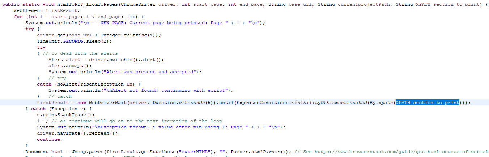

# Java_HTMLtoPDF
## A Java, HTML & CSS Web Scraping project with Selenium ChromeDriver: Creating a PDF version of the latest Mastering Psychiatry ebook on NUSMedicine website
# What this project is about
##### <ins>An essential textbook made better as a PDF</ins>
Mastering Psychiatry is an essential textbook for the Psychiatry posting in Year 4, authored by Melvyn WB Zhang (MBBS SG) and Cyrus SH Ho (MBBS SG). When I saw the 7th Edition (7ed) on NUSMedicine's website is much more aesthetically designed than the 6th Edition, I was elated to download it for my own offline use. Unfortunately, there was only the 6ed PDF available, which is both outdated and is in greyscale.

There were also problems with the website like the inability to zoom in, which makes it hard to read it on a phone.

As the 7ed ebook was likely designed in HTML and CSS (like a website), I felt that getting the PDF file of the 7ed Mastering Psychiatry ebook in the exact same colours and design would be almost impossible.

Thus, I spent 7 days to create my own Java script to convert the website's HTML code to PDF file. Although I was not able to access the CSS file on the website, I learnt that I could create my own CSS file so my script could use it to export the HTML code into a PDF that has the exact same styling as on the website. Thus, I managed to generate my PDF version of the 7ed Mastering Psychiatry on NUS Medicine's website. 

##### <ins>Improvements made in PDF compared to ebook</ins>
The following improvements were made to the 7ed PDF as compared to that on the NUS Medicine's website:
- PDF version of 7ed with all colours and design elements matched exactly with the website
- A4-sized PDF with 1cm margins for more content per page
- All images were manually added into the PDF by me as these were not transferred over with my script
- Font changed to Helvetica for easy reading
- PDF bookmarks added to match the bookmarked topics on the NUS Medicine's website

With permission from the authors, I shared the PDF with my batchmates. It helped me and my batchmates study Psychiatry better.

##### <ins>Java modules used:</ins>
- Selenium with ChromeDriver to load up HTML5 elements (which cannot be loaded with Jsoup alone)
- Jsoup to retrieve HTML code
- iText5 (aka Flying Saucer) to convert HTML to PDF with my custom CSS file

# How this project works
In this section, I detail the errors encountered and lessons I learnt, organised by the modules that were eventually used.

### Selenium ChromeDriver: the best way to load up HTML5 elements
##### <ins>Mistake/Lesson 01: Accessing HTML code using a URI connection in Java instead of reading it from a loaded webpage on Selenium ChromeDriver</ins>
I initally loaded up webpages using `HttpURLConnection` & `URL` classes to access the HTML code. However, I encountered two errors:
| 
|:---:| 
| *`HttpURLConnection` & `URL` classes (available from the java.net package) to access the HTML code* |

**A.** The connection was automatically rejected as it detected that I was not a true browser (automated anti-spam detection; as I was using a script to access the URL). I got the error as [shown here](https://stackoverflow.com/questions/38338418/java-jsoup-html-parsing-robot-index-bot-detection-noindex). After analysing the HTTP connection using my own Google Chrome, I added what was needed to make a HTTP connection: 
- Properties to the connection to simulate a real browser connection (e.g. userAgent, cookies)
- Added the specific cookies the website is looking after analysing the HTML connection through my own Google Chrome 
> Used HashMap to add cookies in the format: **Cookie names**: `incap_ses_xxxx` & `nlbi_xxxx` with their specific **cookie values** 
| 
|:---:| 
| *Added Cookies, UserAgent and a cookie as a header to copy the connection with my own Google Chrome* |

**B.** Despite being able to simulate a true browser connection, I discovered that the `HttpURLConnection` & `URL` classes were simply not good enough to load the [**HTML5 code**](https://www.geeksforgeeks.org/difference-between-html-and-html5/) (they can only load basic **HTML**). They were also not able to load up the Kotobee ebook reader Web App used by the website to generate the HTML code.
- Encountered *"The Kotobee reader web application needs to be run through a web server"* error.

Despite being able to simulate a true browser connection, I discovered that the `HttpURLConnection` & `URL` classes were simply not good enough to load the [**HTML5 code**](https://www.geeksforgeeks.org/difference-between-html-and-html5/) (they can only load basic **HTML**). They were also not able to load up the Kotobee ebook reader Web App used by the website to generate the HTML code.
- Encountered *"The Kotobee reader web application needs to be run through a web server"* error.

With **ChromeDriver**, I do not even have to worry about simulating a real browser connection, or worry about not being able to load Web Apps. With ChromeDriver, you *could* essentially retrieve HTML code from any ebook reader online!
| 
|:---:| 
| *ChromeDriver just makes loading any webpage too easy!* |

### Jsoup to retrieve HTML data
##### <ins>Jsoup: a Java module that easily manipulates HTML code</ins>
**Jsoup** easily manipulates HTML code into a PDF. With **Jsoup**, I can easily add *custom* HTML code (e.g. Cascading style sheet [CSS] code) to the front or the back of the HTML code extracted from the website. Adding CSS code into the HTML before **iTextPDF** parses the entire HTML code (explained later) lets me design however I want the output PDF to be, which even look entirely different from the ebook! 

I created a *HTML_insertbefore* function to use **Jsoup** to read a CSS file (*css_external.css*) and add the CSS code to the *beginning* of the overall HTML code extracted from the website.
| 
|:---:| 
| *css_external.css contains HTML code that determines how a webpage looks. e.g. size & type of fonts* |

To export out the HTML element, we will export out the *outerHTML* attribute. [**outerHTML is an element property whose value is the HTML between the opening and closing tags and the HTML of the selected element itself.**](https://www.browserstack.com/guide/get-html-source-of-web-element-in-selenium-webdriver)

However, we only want to extract the HTML code of the HTML element that is relevant for us. There are lots of HTML codes for the ebook reader that are irrelevant for the output PDF, like the Content page bar on the left.
| 
|:---:| 
| *HTML code of HTML elements irrelevant in our output PDF* |

After inspecting the elements, I discovered that the only relevant HTML element is the element with *class attribute* **"k-section parsed"**. 
| 
|:---:| 
| *HTML element "k-section parsed" contains the content. We can confirm this by inspecting a paragraph, and we find that the 
...
 paragraph HTML elements are stored under the "k-section parsed" element!* |
| 

I then used XPATH to find and retrieve the HTML element I want. With `XPATH_section_to_print = "//section[@class = \"k-section parsed\"]"`, I extracted the HTML element with the class *k-section parsed"*, which happens to be the only HTML element with such a class name in the webpage. 

| 
|:---:| 
| **Variable:** *`XPATH_section_to_print = "//section[@class = \"k-section parsed\"]"* |

### iTextPDF5 (aka Flying Saucer) to parse HTML data into PDF
##### <ins>Jsoup: a Java module that easily parses HTML code into a PDF</ins>
**iTextPDF5** is [an **end-of-life module** that is no longer being updated, except for security fixes](https://itextpdf.com/products/itext-5-legacy). The creators of **iTextPDF5** have went on to create a commercial version, [**iTextPDF7**](https://itextpdf.com/products/itext-7/itext-7-core) that is much more advanced that it can *probably* print webpages better than your default *print to PDF* function of your computer. Nevertheless, **iTextPDF5** still works pretty well in my use case.

**iTextPDF5** easily parses HTML code into a PDF, retaining most of the formatting based *HTML tags (e.g. h1, h2)* and *CSS (Cascading style sheet)* code.

I created various CSS files as needed for the output PDF. For example, I made a CSS document **just for page 310** of the ebook(*externalChp2pg310.css*) to export it as a *29.7cm x 29.7cm* PDF document to fit the huge table.
| 
|:---:| 
| *Content of externalChp2pg310.css document. Here, the output document size, font attributes etc. can be changed to be different from the webpage! * |
| 
| *Huge table (below) would be cut off if it were exported as an A4-sized document* |

**You may even export out the PDF in any custom font you want.** To do so, simply put the required font files (.otf) into your file directory, then tell *ITextFontResolver class* where it can fined those font files. If you did not do this before exporting, The default font used will be *Times New Roman*, which looks ugly in my opinion. With this method, I exported the PDF as the much neater *Helvetica font*, which is also the font used by [stackoverflow webpages](https://meta.stackoverflow.com/questions/286312/what-fonts-does-stack-overflow-use).
| 
|:---:| 
| *Embedding fonts into PDF with the ITextFontResolver class* |

### Making every component work together for the final product
##### <ins>Every function created works together in the *main* function of the *PDFReader* class</ins>
Simply set the *start_page* & *end_page* integer variables to set the pages to export, and watch how all the modules beautifully work together to export the PDF.
| 
|:---:| 
| *Exporting pages 310-312 from NUS Medicine ebook website as PDF* |

# Downloading & Using this project
##### <ins>Basic set up</ins>
**1.** Install *Eclipse* and *Java Development Kit (JDK)*
| 
|:---:| 
| *Install the latest JDK* |

**2.** Click *File* -> *Import*
| 
|:---:| 
| *This Imports + Clones from the Github repository simultaneously* |

**3.** Click Projects from Git
| 
|:---:| 
| *Projects from Git (with smart import) should also work* |

**4.** Select Clone URI
| 
|:---:| 
||

**5.** Paste the GitHub clone URL into the URI, and the rest of the fields should be automatically filled.

**IMPT steps only for the owner to enable pushing to GitHub from Eclipse:**
- Remove *".git"* from the copied clone URL in the URI, or else there will be authorization problems pushing to the remote GitHub repository from Eclipse.
- Fill in *User* as the owner's username
- Fill in *Password* as the GitHub Access Key - this has to be generated on the owner's GitHub account.

| 
|:---:| 
|*Remove ".git" from the copied clone URL in the URI!*|
| 
|*URI should look like this!*|

**6.** Follow steps according to the pictures
| 
|:---:| 
|*Click Next*|
| 
|*Choose Directory to store your project in*|

**7.** Follow steps according to the pictures
| 
|:---:| 
|*Select Import existing Eclipse projects (as there is a pom.xml file in the GitHub repository)*|
| 
|*Click Next*|

##### <ins>Advanced set up</ins>
###### Note: Arial font was not used in this project. It is added in case you want to export the PDF in Arial font (but I did not test if arial.tff works).
**8.**  Download latest **ChromeDriver** according to your current Google Chrome version&dagger; installed on your computer.

&dagger;: See [**Version Selection**](https://chromedriver.chromium.org/downloads/version-selection) to find out which ChromeDriver versions to install 

Extract the ChromeDriver zip file into the `java_htmltopdf/src/main/java/java_HTMLtoPDF/` file directory.

**9.**  Download latest **ChromeDriver** according to your current Google Chrome version installed&dagger; on your computer.
| 
|:---:| 
|*Leave it in the default name `chromedriver_win32`*|

*And you're done! You should be able to run the script and create the PDF*